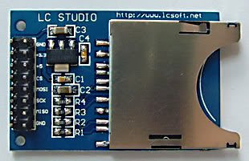

# arduino-sd-log-module
Arduino SD card shield that includes an external 5v-3v3 level shifter.

## The problem
Assume that you need to log some of your readings from the input pins of your Arduino Uno (or MEGA, or ) dev board which needs to work standalone. The proper way is to use an SD card shield. You browse your hardware store and buy the cheapest SD card module (which is generally the LC Studio model):  

Then you find out that it has one quirk: it doesn't work when directly connected to an Arduino Uno. The reason is that SD cards operate around 3v3, but Arduino Uno pins are excited to 5v. (Also note that this problem doesn't exist when you use this module with an Arduino Nano dev board, or a Rasberry Pi, or some ESP boards, since they operate their GPIO pins with 3v3.)  

## The solution
You can pay a few extra dollars which include a level shifter. If you don't, then you need to add an external level shifter circuit. There are 3 pins that need to be shifted to 3v3: CS (pin 4 on Arduino Uno dev board), MOSI (pin 11), SCK (pin 13). One of the proper ways is to use a non-inverting buffer IC. The most common IC that can do such a logic-level shifting operation is the [CD4050](https://www.futurlec.com/4000Series/CD4050.shtml).  

## Circuit board
I designed the circuit so that it may installed on Arduino Uno dev boards as a shield. The layout of Uno boards is as such:  

The shield I implemented is as following:  

The pins close to the edges should be connected to male pins so that the correspond to the female pin headers of the Uno board. The pins next to these represent female headers, so that another shield can come on top this shield. You can omit these if you won't stack another shield. The SD card module can be directly soldered to the PCB, however, this is not a recommended practice. Instead, female pin headers should be used in between. The pads in the middle stand for airwires. My custom CNC machine cannot etch both sides of PCBs, so these should be connected by wires on top of the PCB.  

You can find the EAGLE files in the `circuit` folder. But used parts come from my custom EAGLE parts library. So, you need to have it introduced to EAGLE beforehand. The library can be downloaded [here](https://github.com/tolgakurt/eagle-parts-library).  
