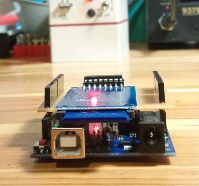

# arduino-sd-log-module
Arduino SD card shield that includes an external 5v-3v3 level shifter.

## The problem
Assume that you need to log some of your readings from the input pins of your Arduino Uno (or MEGA, etc.) dev board which needs to work standalone. The proper way is to store the log in an SD card connected to your board. You browse your hardware store and buy the cheapest SD card module (which is generally the LC Studio model):  

Then you find out that it has one quirk: it doesn't work when directly connected to an Arduino Uno. The reason is that SD cards operate around 3v3, but Arduino Uno GPIO pins are excited to 5v. However, these modules are still relevant because some other dev boards operate their GPIO pins with 3v3, so that this is not a problem when you use them (like an Arduino Nano, or a Rasberry Pi, or some ESP boards, etc.)   

## The solution
We need to shift the voltage of the GPIO pins from 5v to 3v3. You can pay a few extra dollars which include a level shifter. If you don't, then you need to add an external level shifter circuit. There are 3 pins that need to be shifted: CS (pin 4 on Arduino Uno dev board), MOSI (pin 11), SCK (pin 13). One of the proper ways is to use a non-inverting buffer IC. The most common IC that can do such a logic-level shifting operation is the CD4050.  

What this IC does is pretty straightforward. It should be powered with the 3v3 output pin of the Arduino Uno and it should use the same ground. Then, for example, if you feed 9th pin with a 5v signal, you will get the same signal shifted to 3v3 from 10th pin. For the pin roles, take a look at the [datasheet](https://www.futurlec.com/4000Series/CD4050.shtml).

## Circuit board
I designed the circuit in such a way that it may be installed on Arduino Uno dev boards as a shield. The layout of Uno boards is as such:  

The shield I implemented is as the following:  

The pads close to the top and bottom edges is for pins so that they correspond to the female headers of the Uno board. You can solder male pins, but if you want to stack another shield on top of this, then you need to solder female pins with long legs here. You can also omit most of the pins, for example the whole Analog IO group.  

The SD card module should be directly soldered to the PCB, if you wish to stack another shield on top of this. Using female headers in between the SD module and the shield increases height of the total assembly, which requires the upper shield to have very long legs. The pads in the middle is for an airwire. My custom CNC machine cannot etch both sides of PCBs, so these pads should be connected by a wire on top of the PCB.  

You can find the EAGLE files in the `circuit` folder. But used parts come from my custom EAGLE parts library. So, you need to have it introduced to EAGLE beforehand. The library can be downloaded [here](https://github.com/tolgakurt/eagle-parts-library).  

Here are some pictures of the built board:  

